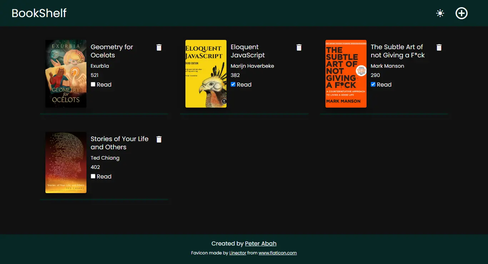
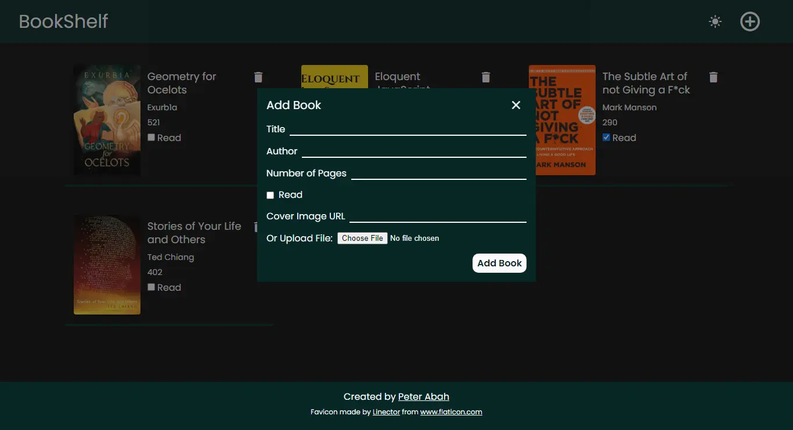

# Library

This is a simple library app where users can enter details about a book and store it.

The project is part of [The Odin Project's Curriculum](https://theodinproject.com).

[Live Preview](https://peter-abah.github.io/library)

## Screenshot

## Built With
- HTML
- CSS
- SCSS
- JS
- BEM

## What I learnt
The purpose of the project was to practice using Object constructors.
I decided to try using BEM methodology and it felt a whole easier writing css especially when I combined it with sass.

I also implemented a dark mode feature. This was my first time implemeting dark mode. It was suprisingly easier than i thought.
I used CSS custom properties to store color values for both light and dark, then switching the theme was just toggling classes with JavaScript.

## Useful Resources
- [A Complete Guide to Dark Mode on the Web | CSS-Tricks](https://css-tricks.com/a-complete-guide-to-dark-mode-on-the-web/#using-a-body-class)
- [BEM 101 | CSS=Tricks](https://css-tricks.com/bem-101/)

## Author
Peter Abah

## Acknowlegments
- [The Odin Project](https://theodinproject.com)
- Favicon by [Linector](https://www.flaticon.com/authors/linector), gotten from [Flat Icon](https://www.flaticon.com/)